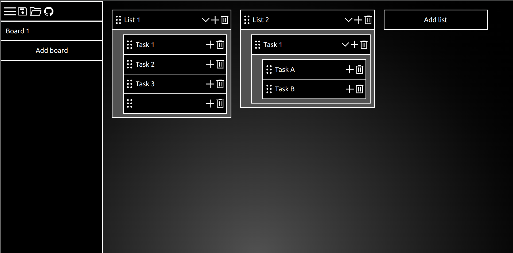
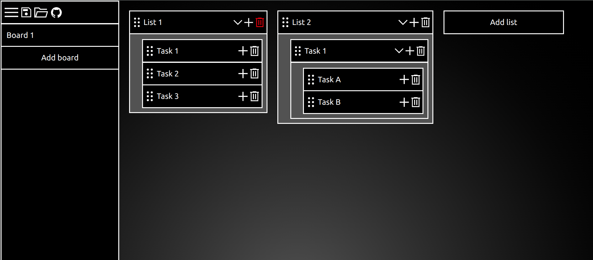

# Nested To Dos

A simple to do app that allows for nested to dos.

## Features
Click the menu to fold your boards out of the way.

Click the plus to add new sub-lists

Click the trash twice to delete a list.

Click the arrow to fold a list.

Click the floppy disk to export your boards and the open folder to load them in.

Click the 6 dots to move a lists.

